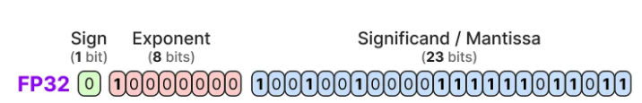
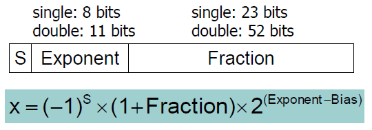

# IEEE754 Single Precision
---


---
```
지수부분은 -127의 bias 를 더한다.
0000 0000 과 1111 1111 은 특수 케이스로 나중에 설명

Mantissa 는 1이 앞에있다고 가정하고 1.xxxx..xx(23개) 로 본다.
지수부분과 관련된 특수케이스는 뒤에 설명
```

### 양의 최대값
```
sign: 0
Exponent: 1111 1110 -> 254-127 = 127
Mantisa:  all 1s    -> ≈ 2 (1.111...111(23개))

X ≈ (-1)^0 x 2^127 x 2 = 2^128
```

### 양의 최소값
```
sign: 0
Exponent: 0000 0001 -> 1-127 = -126
Mantisa:  all 0s    -> = 1 

X = (-1)^0 x 2^(-126) x 1 = 2^(-126)
```

### 음의 최대값 (0과 가까운)
```
sign: 1
Exponent: 0000 0001 -> 1-127 = -126
Mantisa:  all 0s    -> = 1

X ≈ (-1)^1 x 2^(-126) x 1 = 2^(-126)
```

### 음의 최소값 (0과 먼)
```
sign: 1
Exponent: 1111 1110 -> 254-127 = 127
Mantisa:  all 1s    -> ≈ 2

X = (-1)^1 x 2^127 x 2 = -1 x 2^128
```
---
## 특수케이스

### 0 과 ∞
```
0 은 Exponent 와 Mantissa 가 모두 0 이며
Sign에 따라 +0, -0 구분

∞ 는 Exponent 가 모두 1, Mantissa 는 모두 0
Sign에 따라 +∞, -∞ 구분
```

### NaN
```
Exponent 가 모두 1, Mantissa 는 0 아닌수 (Sign 무관)
```
---

## 비정규화수 (Denormalized Number)
```
Exponent 가 all 0s -> -126으로 계산
Mantissa 는 정규화수와 다르게 0.xxx..xxx(23개) 로 계산
Sign 은 무관

Ex)
0 00000000 00000000000000000000001 = (-1)^0 x 2^(-126) x 2^(-23) = 2^(-149)

0 00000000 11111111111111111111111 = (-1)^0 x 2^(-126) x (1 - 2^(-23)

```

